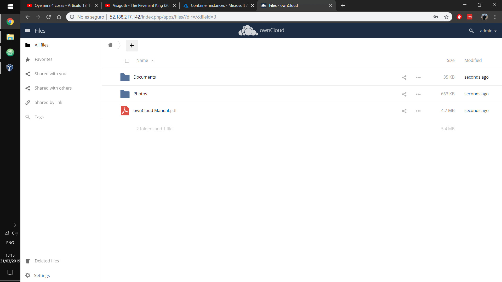
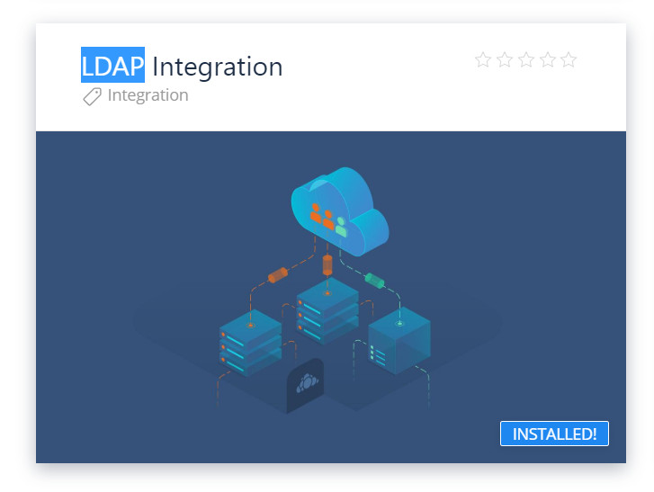

# Cloud Computing 2

## Práctica 1

### Crear y configurar 3 MV usando contenedores

Aunque inicialmente se comenzó a realizar la práctica usando máquinas virtuales sobre las que correr Docker, se ha descubierto que se puede trabajar en Azure usando directamente contenedores, lo que es más rápido y barato.

1. __Owncloud:__ Usaremos una imagen ya creada, por lo que basta escribir en la consola de Azure

```bash
az container create --resource-group CC2 \
                    --dns-name-label cc2-owncloud \
                    --name ownclouddocker \
                    --image owncloud \
                    --ports 80
```

2. __MySQL:__ Como las imágenes existentes no están correctamente configuradas, crearemos nosotros la nuestra, que puede verse en [Dockerfile-mysql](Dockerfile-mysql), y la siubiremos a DockerHub, como puede verse [en el siguiente enlace](https://hub.docker.com/r/pedroma1/docker-mysql), para poder importarla desde Azure.

```dockerfile

FROM ubuntu:latest

WORKDIR /

RUN apt-get update && \
    apt-get install -y python-mysqldb mysql-server && \
    service mysql start && \
    mysql -e "CREATE DATABASE owncloud" && \
    mysql -e "CREATE USER 'root'@'%' IDENTIFIED BY ''" && \
    mysql -e "GRANT ALL PRIVILEGES ON *.* TO 'root'@'%' WITH GRANT OPTION" && \
    sed -i 's/bind-address/#bind-address/' /etc/mysql/mysql.conf.d/mysqld.cnf && \
    service mysql stop && \
    chown -R mysql:mysql /var/run/mysqld

VOLUME ["/var/lib/mysql"]

EXPOSE 3306

CMD ["mysqld_safe"]

```
Ahora, desde Azure creamos un contenedor con dicha imagen ejecutando:

```bash
az container create --resource-group CC2 \
                    --dns-name-label cc2-mysql \
                    --name mysqldocker \
                    --image pedroma1/docker-mysql \
                    --ports 3306
```

Ahora ya podemos acceder al servidor Owncloud y crear un configurarlo con la IP y los datos con los que hemos creado el contenedor de MySQL, además de crear un usuario y contraseña. Una vez hecho, seremos redirigidos a una página similar en la que podremos hacer login. Después de esto, ya podemos acceder a nuestros archivos.



3. __LDAP.__ Lo primero que haremos será instalar el plugin de LDAP en Owncloud. Para eso, vamos al mercado de owncloud, buscamos la aplicación _LDAP Integration_ y la instalamos en nuestro servidor.



Ahora, crearemos un contenedor en Azure con LDAP. Para ello, podemos usar la imagen vista en clase, `larrycai/openldap`, o la de Osixia, `osixia/openldap`. Como varios compañeros han tenido problemas con el primero, en este caso preventivamente usaremos el segundo, para lo que basta ejecutar en la terminal de Azure,

```bash
az container create --resource-group CC2 \
                    --dns-name-label cc2-ldap \
                    --name ldapdocker \
                    --image osixia/openldap \
                    --ports 389 636
```
